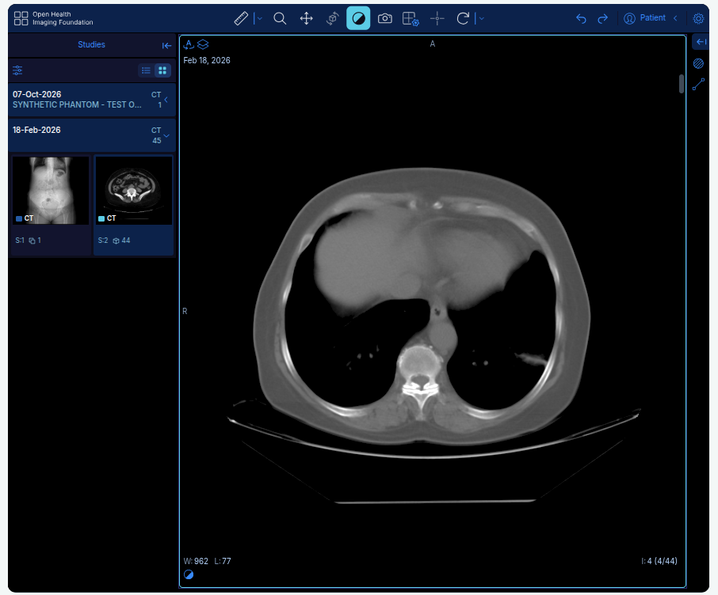

# PACS Patient Portal

A patient imaging portal built with FastAPI, Jinja2, Orthanc, and the OHIF DICOM viewer. Staff upload DICOM images, review the patient identity, and approve studies before patients can view them. The portal interface is in Persian.

[راهنمای فارسی / Persian documentation](README_FA.md)

## DICOM viewer



The screenshot shows a CT study in OHIF, with series thumbnails on the left and the current slice counter (`4/44`) at the bottom right. Move the cursor over the image and scroll the mouse wheel to navigate through the series. The toolbar provides zoom, pan, window/level, and measurement tools. The bundled synthetic demo described below contains eight slices.

## Run locally

The automatic local launcher supports **Ubuntu 26.04 on x86_64**. It requires:

- Python **3.12 or newer**, with `venv` support.
- Bash, `apt`, `dpkg-deb`, `ldd`, `ss`, and `flock`.
- Internet access for the initial dependency and viewer downloads.

Clone the repository and run the launcher from the project root:

```bash
git clone https://github.com/shosseinj/Pacs_patient_portal.git
cd Pacs_patient_portal
bash run.sh
```

Open **[http://127.0.0.1:8080/portal](http://127.0.0.1:8080/portal)**.

On a fresh local installation, the development login is:

| Username | Password |
| --- | --- |
| `admin` | `Asd@12345` |

These credentials are displayed and prefilled on the local development login page. Existing accounts and passwords are preserved. The initial credentials are also saved to `data/local-admin.txt`.

### What the launcher does

- Creates or reuses `~/video/.venv/` and installs the pinned Python dependencies there.
- Downloads and extracts missing Orthanc, Nginx, and OHIF files into `data/runtime/`, without installing system packages or requiring a Docker daemon.
- Creates local `.env` settings and a SQLite database when needed.
- Stops the previous project services and frees TCP ports **8000, 8042, 8080, and 8081**. Listeners on these ports are terminated, including listeners from other projects; if they do not stop normally, the launcher force-stops them. It exits with an error if the current account cannot free a port.
- Starts the portal, background worker, archive, and viewer gateway in the background.

Run `bash run.sh` again to restart the services. Accounts, uploaded images, and database files remain in `data/`. Service logs are in `data/runtime/*.log`; Nginx logs are in `data/runtime/nginx/`.

To use a different virtual environment location:

```bash
PACS_VENV="$HOME/my-venvs/pacs" bash run.sh
```

For a fresh installation on another computer, clone the source and let the launcher create its own environment and settings. Local `.env` files, runtime data, and virtual environments are excluded from Git.

## Try the synthetic DICOM study

1. Sign in as the development administrator and create a test patient account.
2. Set the patient's **DICOM Patient ID** to `DEMO001` and **Issuer** to `DEMO`.
3. Upload `examples/synthetic/demo-study.zip` from that patient's page. The archive contains eight synthetic CT slices.
4. Wait for processing, review the identity, and select **تأیید و نمایش به بیمار** to approve the images for the patient.
5. Open **مشاهدهٔ تصاویر** from the study card. Scroll over the image to change slices.

The patient can then sign in with the account created in step 1 and view the approved study. All bundled sample images are synthetic.

## Docker deployment

The repository also includes Docker Compose configuration using PostgreSQL. On a fresh deployment copy with Docker and Docker Compose **2.24.4 or newer**:

```bash
python3 scripts/configure.py
bash scripts/start.sh
docker compose exec portal python -m scripts.manage create-admin --username admin
```

Choose the administrator password interactively; the Docker setup does not create the local development account. Use Docker for Windows or macOS development instead of the Ubuntu-specific local launcher. See [README_FA.md](README_FA.md) for HTTPS deployment, backups, and account management.

## License

Project code is licensed under [MIT](LICENSE). Orthanc, OHIF, and other dependencies retain their own licenses.
